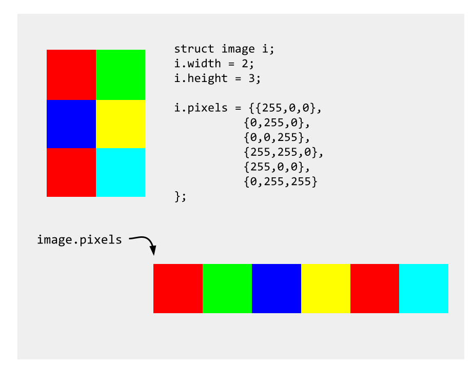
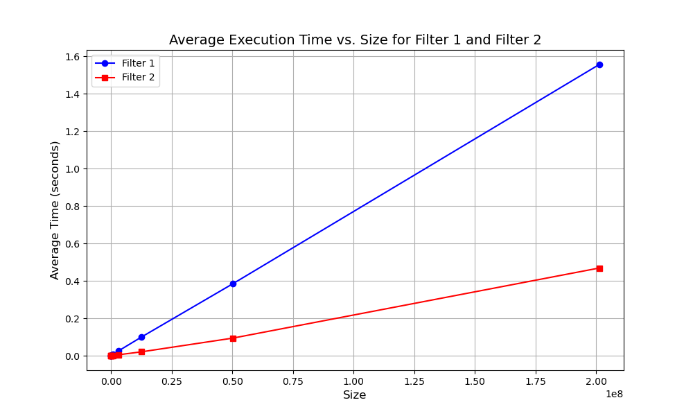

# Image Calculator

In this problem set, we will be building several operations of an image calculator in C.

Our C image calculator will allow us to take in as input, a path to an input image, width, height, a specified operation, and an output path. Then, our C image calculator, will perform the operation on the input image and save the new image at the output path.

## Step 0: What is an image and provided loader.c 

### Included Files
For this project we supply you with:
- `common.h` which specifies the structure of an image in our calculator program
- `loader.h` and `loader.c`: These make up an image library, which loads/saves images in the `.bmp` format. 
- `filter.c` which we will use in Step 5/6. We will analyze how well the supplied filter operations perform and inspect their cache behavior.
- `imgops.h` specifying the function headers for the different image operations (you will be implementing these!)
- `Makefile` The makefile for this project is included! Simply type `make` and the correct executables will be built in `build` directory.
- `images/` is a directory of bmp format images which you can use as input.
    - `16x16.bmp` - `4096X4096.bmp` will be used in step 5 to analyze the performance of image operations on various sized images.
- `reference/` is a directory containing reference images for each operation. 
    - Check these out on gihub.com in order to see a good example of what your output should look like!

You will need to create `imgops.c`, which will implement the functionality of the image operations.
You will also need to complete `image_calc.c` which is the driver for our image calculator.

### Image Representation

An image in our program is a 2d array of pixels. Each pixel has a red channel (ranging from 0-255), a green channel (ranging from 0-255), and a blue channel (ranging from 0-255).

The 2d array is flattened and represented in row-major order. This is a common convention for how to represent 2d arrays in one contiguous block in memory.

See: (https://diveintosystems.org/book/C2-C_depth/arrays.html#_method_1_memory_efficient_allocation) for an example of how we are efficiently allocating and accessing our 2d array.

An image has a width, height, and an array of pixels.



- View the images!
- On GitHub (maybe you are viewing the readme from github already), click the following link: [/images/sky.bmp](/images/sky.bmp)
    - Click 'view raw'. You should see an image of a sky.

To find the dimension of an image, use the following command:

```file images/sky.bmp```

- You should see the dimension: `640 x 426 x 24`. This means the image width is 640, the height is 426, and there are 24 bits used to represent each pixel (you can ignore this!).


## Step 1: Allocate Space for an Image

- in `image_calc.c` process the command-line arguments from argc**.
    - **Note**: The Dive Into Systems reading on command-line arguments may be helpful, especially how to process integer inputs. (https://diveintosystems.org/book/C2-C_depth/advanced_cmd_line_args.html#_c_cmd_line_args_)
    - The command line arguments will be in the following format:
        - ```./build/image_calc <input_image_path> <width> <height> <operation> <output_path>```
    - An example of how to run the image_calc command is below:
        - ```./build/image_calc images/sky.bmp 640 426 grayscale grayscale.bmp```
        - remember to use the `file` command to find the dimension of an image you wish to run image_calc on.
    
- in `image_calc.c` add code to `malloc` the space needed for an image struct **and its pixels**. 
    - We will pass an address to this allocated space to `loadimage` which will populate our image struct with the read-in data from a specified `.bmp` file.
- populate the variables `input_filepath` with the input file path from argc.
- populate the variable `output_filepath` with the output file path from argc.

- At this point you should be able to run the command:
    - ```./build/image_calc images/sky.bmp 640 426 grayscale out_grayscale.bmp```
    - Remember to `make` first!
    - However, since you have not implemented the operation yet, this command will save a copy of an identical image at `out_grayscale.bmp`.

## Step 2: Implement Grayscale

- create `imgops.c` which will implement the functions declared in `imgops.h`
- implement the logic of `grayscale`.
- `grayscale` takes as input a pointer to an image. It wil modify that image to be grayscale.
- in order to make an image grayscale, make each pixel's color (it's red, blue, and green channels) the average of it's red, green, and blue value.
    - for example if we have a pixel where rgb(100,200,0) the grayscale image would have instead a pixel where rgb(100,100,100).
    - use integer division (truncate) for any division operation.

- add the functionality in `img_calc.c` to parse if the passed in operation argument equals "grayscale".
    - if it does, call your grayscale function on the loaded/allocated image.

- Run:
    - ```./build/image_calc images/sky.bmp 640 426 grayscale out_grayscale.bmp```

- commit your changes, navigate to `out_grayscale.bmp` on github.com, and click "view raw" in order to view your bmp image!

## Step 3: Implement Reflect

- implement the logic of `reflect`
- `reflect` takes as input a pointer to an image. It will modify that image to be reflected vertically.
- see the example below for the desired output:


- add the functionality in `img_calc.c` to parse if the passed in operation argument equals "reflect".
    - if it does, call your reflect function on the loaded/allocated image.

- Run:
    - ```./build/image_calc images/sky.bmp 640 426 reflect out_reflect.bmp```

- commit your changes, navigate to `out_reflect.bmp` on github.com, and click "view raw" in order to view your bmp image!


## Step 4: Greenscreen 

Now we wish to add a greenscreen functionality to our image calculator. How this will work, is we will have one function, which we first call, to generate a pretty background (in our case a blue gradient). Then we will call greenscreen on an input image and this background. The logic of greenscreen should replace every bright green (or close to bright green) pixel, with the corresponding pixel from our background image.

### Step 4a: Implement Generate Blue Gradient

Generate blue gradient will take as input a width and a height and return a pointer to a new allocated image.

To generate our blue gradient, we want to itterate repeatedly over the colors (255,255,0), (255,255,1) ... (255,255,255), as we go through the image, pixel by pixel in row-major order.

Implement `generate_blue_background`.

### Step 4b: Implement Greenscreen 

Greenscreen will be called with a source image (which has a green background). Greenscreen will also have a parameter corresponding with the new background image (which for us will be our generated blue background). We want to replace any green in the source image, with the background image.

Implement greenscreen. Use the function `close_to_green` in order to check if a pixel is close to green. This allows a little tolerance of pixels that are not quite perfectly rgb(0,255,0). 

- add the functionality in `img_calc.c` to parse if the passed in operation argument equals "greenscreen".
    - if it does, generate a blue background, call your greenscreen function on the input image and this new background.

- Run:
    - ```./build/image_calc images/green-person.bmp 350 350 greenscreen out_greenscreen.bmp```
- commit your changes, navigate to `out_greenscreen.bmp` on github.com, and click "view raw" in order to view your bmp image!

At this point running `./test.sh` should show that your code passes all tests.

## Step 5: Profiling our Image Filter

Good work on your image calculator! For our last step we will be learning how to profile our code. We have provided 2 image operations, in `filter.c`. The Makefile automatically builds `./build/filter` binary.

The filter command is executed as follows:
`./build/filter <path_to_image> <1 or 2> <width> <height>`

We have two implementations of our filter, `filter1` and `filter2` switching the 2nd argument to `1` will run `filter1` and switching it to `2` will run `filter2`.

For example:

`./build/filter images/2048x2048.bmp 1 2048 2048` runs `filter1` on `images/2048x2048.bmp`


`./build/filter images/2048x2048.bmp 2 2048 2048` runs `filter2` on `images/2048x2048.bmp`

Our goal is to analyze the performance of these two implementations.
You should see they produce identical results (they are both correct), however, we wonder, do they have differing performance?

**Please answer the following questions in a new PDF, which will be uploaded to gradescope**

#### Step 5a: Inspecting filter1() and filter2()

What is the functionality of filter1 and filter2? What do these two functions return?

How do `filter1` and `filter2` differ in their implementation? They are practically identical except for one small difference. Read the code for both functions. What is the difference?

Write your answer in your PDF write-up.

### Profiling

Included in the `main()` method of our `filter.c` code is a few lines which measure and report time time taken (in seconds) of our filter operation.

We are using a function in the C `time.h` library called `clock_gettime` which snapshots the current time and saves it in a special struct called a timespec.

Type `man clock_gettime` for more details on how this function is used.

Our program calls this function twice: once before filter is run, and once after filter is run and then calculates the difference between these two times. Then, the program reports the time as seen below.

```
$ ./build/filter images/1024x1024.bmp 2 1024 1024
   running filter2
   time = 0.014726 seconds
   Result: 458131
```

This means that the time spent running filter was 0.0147 seconds. You may notice that the command as a whole takes longer, this is because some time is spent loading the image!

#### Step 5b: Plot the timing data.
Run each binary 10 times for each image file and create a line plot of the results, where the plot has one line for each program's results.  The x-axis should be the size of the image in bytes (not the image dimension!) and the y-axis being the average measured user time in seconds.  Remember, the size of a matrix in bytes is the dimension squared times `sizeof(struct pixel)`. Eg. The size in bytes of the `16x16.bmp` image is $16 \times 16 \times 12 = 3072$ bytes.

In short, you will have 180 total data points, 10 data points for each of the 9 image sizes used with both the filter1 and filter2 programs. For each program, you will plot the mean of the 10 runs for each image size.


**Note1:** We have provided a Bash script to automate gathering your data to save you time. In the `eval.sh` script, we looped over each program (1 and 2) as p and over each image size as s, then ran this loop to generate 10 times for every combination:

```
 for ((i=0; i<$trails; i++)); do
		./build/filter images/${s}x${s}.bmp $p $s $s >> data/filter$p.$s.out
	    done
```

**Note2:** We have also provided a `plot.py` file that will generate a graph from the data you gather.  You can run this script with the following command: `python3 plot.py` and commit the produced plot to your repository to access it on GitHub's website.

The following is an example of how the graph should look with respect to formatting.  **The data on the following graph is dummy data - do not expect your plots to look the same**



Please place a copy of your graph in your PDF write-up.


#### Step 5c: Describe the data

Provide a brief paragraph, in your PDF write-up, that summarizes what the plot is telling you. Also, in words, how much do the max and min vary between runs. This should be no more than three to four sentences in length. 

### Step 6: What is going on?

Use the following commands to gather a report on how the programs behave with respect to their memory accesses and the caches.
```
$ valgrind --tool=cachegrind --cache-sim=yes ./build/filter images/1024x1024.bmp 2 1024 1024
```


```
$ valgrind --tool=cachegrind --cache-sim=yes ./build/filter images/1024x1024.bmp 1 1024 1024
```
These commands will produce quite a bit of output.  This tool runs the given program and analyzes its memory access behaviour.  Do a little research on the terms you see in the report.  Identify what seems to be different between the two programs.


 ``Valgrind`` is a powerful tool that allows us to learn about how a program accesses memory.  In particular we are using a sub-tool called ``cachegrind'' (https://valgrind.org/docs/manual/cg-manual.html). Cachegrind uses data it gathers about the memory accesses (what addresses and number of bytes the program loads and stores to) along with knowledge it has about the system's caches to provide us with insight on how a program behaves with respect to caching.

**Note2**: Recall the concept of cache hits and cache misses from (https://cs-210-infrastructure.github.io/UndertheCovers/lecturenotes/assembly/L16.html).
**Note3**: You may find the following useful (These are not academic articles and may have flaws):
- (https://www.extremetech.com/extreme/188776-how-l1-and-l2-cpu-caches-work-and-why-theyre-an-essential-part-of-modern-chips)
- (https://www.makeuseof.com/tag/what-is-cpu-cache/)
- (https://en.wikipedia.org/wiki/CPU_cache)


### Step 6a: Analyze your Results

Place the results of your valgrind output in your PDF write-up.

Write one short paragraph, describing what you learned and why there might be a difference in performance. Please follow the notes on how to find the reason they are different.


